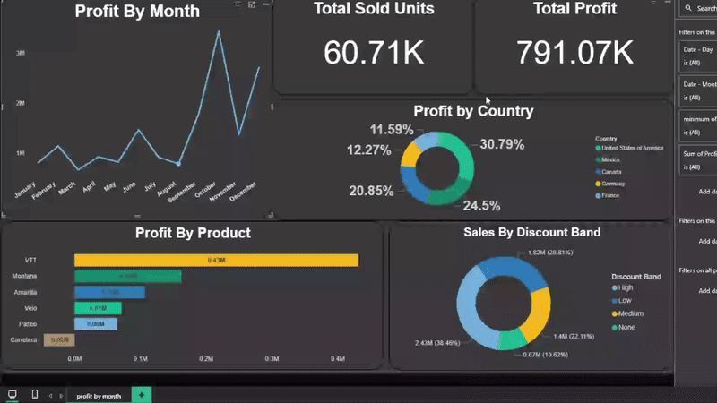

# 📊 Product Sales Analytics Dashboard

An end-to-end data analytics project featuring comprehensive sales data processing, cleaning, and visualization through an interactive Power BI dashboard designed for data-driven business decision-making.



## 🎯 Project Overview

This project demonstrates a complete data analytics workflow from raw sales data to actionable insights. It encompasses data cleaning, transformation, and visualization to help stakeholders understand sales performance, identify trends, and make informed business decisions.

## ✨ Key Features

- **Interactive Dashboard**: Fully interactive Power BI dashboard with drill-down capabilities
- **Clean Dataset**: Processed and validated sales data ready for analysis
- **Multiple KPIs**: Track revenue, sales volume, product performance, and regional trends
- **Time-Series Analysis**: Historical trend analysis for forecasting and planning
- **Visual Analytics**: Multiple chart types for comprehensive data storytelling

## 📁 Project Structure

```
ProductSalesProject/
├── dashboard.gif              # Dashboard demo animation
├── [Dataset Files]            # Cleaned sales data
├── [Power BI File]            # Interactive dashboard (.pbix)
└── README.md                  # Project documentation
```

## 🛠️ Technologies Used

- **Power BI Desktop**: Dashboard creation and data visualization
- **Data Processing**: Data cleaning and transformation
- **DAX**: Advanced calculations and measures
- **Power Query**: ETL operations

## 📈 Dashboard Components

The interactive dashboard includes:

### Key Performance Indicators (KPIs)
- Total Revenue
- Total Units Sold
- Average Order Value
- Sales Growth Rate

### Visualizations
- **Sales Trends**: Time-series analysis of revenue and volume
- **Product Performance**: Best and worst performing products
- **Geographic Analysis**: Sales distribution by region/location
- **Category Breakdown**: Performance by product categories
- **Customer Insights**: Purchase patterns and segments

### Interactive Features
- Date range filters
- Product category slicers
- Regional filters
- Dynamic drill-through pages
- Hover tooltips with detailed information

## 🚀 Getting Started

### Prerequisites

- **Power BI Desktop** (Latest version recommended)
  - Download from [Microsoft Power BI](https://powerbi.microsoft.com/desktop/)
- **Microsoft Excel** or compatible spreadsheet software (for data files)

### Installation & Setup

1. **Clone the Repository**
   ```bash
   git clone https://github.com/NoahMustafa/ProductSalesProject.git
   cd ProductSalesProject
   ```

2. **Open the Dashboard**
   - Launch Power BI Desktop
   - Open the `.pbix` file from the repository
   - The dashboard will load with all visualizations and data

3. **Explore the Data**
   - Navigate through different pages of the dashboard
   - Use filters and slicers to customize your view
   - Drill down into specific metrics for detailed analysis

## 📊 Data Processing Pipeline

### Data Cleaning Steps
1. **Null Value Handling**: Removed or imputed missing data
2. **Data Type Validation**: Ensured correct data types for all columns
3. **Duplicate Removal**: Eliminated redundant records
4. **Outlier Detection**: Identified and handled anomalous values
5. **Standardization**: Normalized formats for dates, currencies, and text fields

### Data Transformation
- Created calculated columns for enhanced analysis
- Developed custom measures using DAX
- Established relationships between data tables
- Built date dimension for time intelligence

## 💡 Use Cases

This dashboard is designed for:

- **Sales Managers**: Monitor team performance and identify opportunities
- **Business Analysts**: Conduct deep-dive analysis into sales patterns
- **Executive Leadership**: Track high-level KPIs and strategic metrics
- **Marketing Teams**: Understand product and regional performance
- **Operations**: Optimize inventory and resource allocation

## 📝 Key Insights & Analysis

The dashboard enables analysis of:

- Sales performance over time (daily, monthly, quarterly, yearly)
- Product profitability and contribution margins
- Regional sales disparities and opportunities
- Seasonal trends and patterns
- Customer segmentation and behavior
- Sales forecasting and projections

## 🔧 Customization

To adapt this dashboard for your own data:

1. **Update Data Source**: Replace dataset with your sales data
2. **Modify Measures**: Adjust DAX formulas to match your business logic
3. **Customize Visuals**: Change colors, themes, and chart types
4. **Add New Pages**: Create additional views for specific analyses

## 📌 Best Practices Demonstrated

- Clean and documented data processing workflow
- Modular dashboard design for easy maintenance
- Performance-optimized DAX measures
- User-friendly interface with intuitive navigation
- Responsive layout for different screen sizes


## ⚖️ License & Attribution

**Important**: If you use or redistribute this dashboard, please provide proper attribution by mentioning the original creator.

```
Original Author: Noah Mustafa
Repository: https://github.com/NoahMustafa/ProductSalesProject
```

Do not re-upload or share this dashboard without crediting the original source.

## 📧 Contact

**Noah Mustafa**

- GitHub: [@NoahMustafa](https://github.com/NoahMustafa)
- Project Link: [https://github.com/NoahMustafa/ProductSalesProject](https://github.com/NoahMustafa/ProductSalesProject)

## 🙏 Acknowledgments

- Thanks to the Power BI community for inspiration and best practices
- Data visualization principles from Storytelling with Data
- Open-source contributors who make projects like this possible

## 🗺️ Roadmap

Future enhancements planned:

- [ ] Add predictive analytics using Python/R integration
- [ ] Implement real-time data refresh capabilities
- [ ] Create mobile-optimized dashboard views
- [ ] Add automated reporting and email alerts
- [ ] Include advanced statistical analysis
- [ ] Develop API integration for live data feeds

---

⭐ **If you find this project helpful, please consider giving it a star!**

*Last Updated: October 2025*
